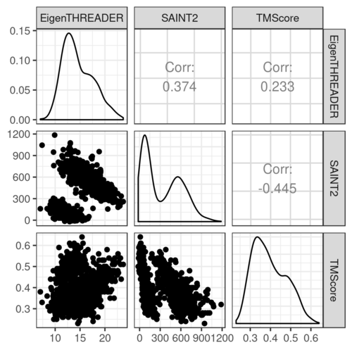

In this blog post I will introduce a fun R plot, ggpairs, that's useful for exploring distributions and correlations. 

<!--more-->

Recently, I was trying to recreate the kind of base graphics figures generated using plot() or pairs()

For example, let's say we have 500 models of two target proteins, and we want to compare how two scores (e.g. EigenTHREADER, SAINT2) compare to the quality of the models (TMScore):

```R
require(dplyr)
df = read.table("https://raw.githubusercontent.com/clarewest/RFQAmodel/master/data/RFQAmodel_training.txt", 
                header=TRUE, 
                stringsAsFactors=FALSE) %>%
     filter(Target %in% c("2OBA_B","3HSB_D")) %>% 
     select(Target, EigenTHREADER, SAINT2, TMScore)

plot(df[,2:4])

```


I'm interested in recreating this plot using my visualisation package of choice, ggplot2, and I found the best way to do this is using ggpairs ("Ggplot2 Generalized Pairs Plot"), part of the ggplot2 extension package GGally.

- [GGally documentation](https://ggobi.github.io/ggally/)
- [ggpairs documentation](https://www.rdocumentation.org/packages/GGally/versions/1.4.0/topics/ggpairs)


This function creates a similar plot to the base example above, with the added benefit of displaying the correlation coefficient (Pearson, by default) in the upper triangle, distributions on the diagonal, and all the fun flexibility that you would expect from ggplot2:

```R
require(ggplot2)
require(GGally)
ggplot2::theme_set(ggplot2::theme_bw())  ## (this just globally sets the ggplot2 theme to theme_bw) 
df %>% select(-Target) %>% ggpairs()

```


Plots in the upper and lower triangles and the diagonal are modified separately. The options and parameters are passed to each  as a list.


Each combination of variables are plotted according to whether they are:

- continuous: e.g. "points" (lower default), "smooth", "smooth_loess", "density", "cor" (upper default), or "blank"
- combo: e.g. "box", "box_no_facet" (upper default), "dot", "dot_no_facet", "facethist", "facetdensity", "denstrip", or "blank"
- discrete: e.g. "ratio", "facetbar", or "blank"


Plots on the diagonal can either be:

- continuous: "densityDiag", "barDiag", "blankDiag"
- discrete: "barDiag", "blankDiag"

(If you are not familiar with the term facet, it refers to the [splitting of a single plot into two or more panels (facets)](https://ggplot2.tidyverse.org/reference/facet_grid.html), and is one of the most useful features of ggplot2)


For example, to plot points with a smoothed line for pairs of continous variables in the lower triangle, and make the points smaller and more transparent:


```R

df %>% select(-Target) %>% ggpairs(., lower = list(continuous = wrap("smooth", alpha = 0.3, size=0.1)))

```


It's also possible to provide your own plotting function. 

We can now map aesthetics, for example colour the points according to the target protein, which will also show the (far more interesting) correlations within the target proteins separately: 

```R
df %>% ggpairs(., 
               mapping = ggplot2::aes(colour=Target), 
               lower = list(continuous = wrap("smooth", alpha = 0.3, size=0.1)))
```


Notice how we now have facethist and box plots for "combo" (discrete and continuous) combinations of variables in the lower and upper triangles, respectively, and a bar plot showing the total number of models on the Target diagonal. 

You can also display a legend.

By default all columns of the data are included in the plot, use the columns argument to exclude:

```R
df %>% ggpairs(.,
               legend = 1,
               columns = 2:4, 
               mapping = ggplot2::aes(colour=Target), 
               lower = list(continuous = wrap("smooth", alpha = 0.3, size=0.1))) +
               theme(legend.position = "bottom")  
```


Some extra things for my final plot:

- To change the alignment of the correlation labels to fit the group names in, use alignPercent
- Change the alpha so we can see the distributions more clearly 
- Remove the histograms 

```R
df %>% ggpairs(.,
               title = "A Nice Plot Using ggpairs", 
               mapping = ggplot2::aes(colour=Target), 
               lower = list(continuous = wrap("smooth", alpha = 0.3, size=0.1), 
                            discrete = "blank", combo="blank"), 
               diag = list(discrete="barDiag", 
                           continuous = wrap("densityDiag", alpha=0.5 )), 
               upper = list(combo = wrap("box_no_facet", alpha=0.5),
                            continuous = wrap("cor", size=4, alignPercent=0.8))) + 
               theme(panel.grid.major = element_blank())    # remove gridlines 
```


Now my problem is that I'm not interested in that first column. Getting around this is a bit convoluted, but here's my solution.


You can extract individual or combinations of panels:

```R
p <- df %>% ggpairs(.,
               title = "A Nice Plot Using ggpairs", 
               mapping = ggplot2::aes(colour=Target), 
               lower = list(continuous = wrap("smooth", alpha = 0.3, size=0.1), 
                            discrete = "blank", combo="blank"), 
               diag = list(discrete="barDiag", 
                           continuous = wrap("densityDiag", alpha=0.5 )), 
               upper = list(combo = wrap("box_no_facet", alpha=0.5),
                            continuous = wrap("cor", size=4, alignPercent=0.8))) + 
               theme(panel.grid.major = element_blank())    # remove gridlines 

getPlot(p, 1, 4) + guides(fill=FALSE)
```


So if I extract the panels I'm interested in, I can then display them using ggmatrix

```R
plots = list()
for (i in 1:4){
  plots <- c(plots, lapply(2:p$ncol, function(j) getPlot(p, i = i, j = j)))
}  
ggmatrix(plots, 
         nrow = 4, 
         ncol=p$ncol-1, 
         xAxisLabels = p$xAxisLabels[2:p$ncol], 
         yAxisLabels = p$yAxisLabels, 
         title="Nice plot with only the panels I care about")

```


~~Sidenote: If you know how to iterate over i and j at once in apply (and end up with a list) please share your secrets with me.~~

Update: My colleague [Lyuba](https://twitter.com/lbozhilova) has offered a better solution to the above iteration method using expand.grid:

```R
plots <- apply(expand.grid(i=1:4, j=2:p$ncol), 1, function(ij) getPlot(p, i=ij[1], j=ij[2]))
ggmatrix(plots,
         byrow=FALSE, 
         nrow = 4, 
         ncol=p$ncol-1, 
         xAxisLabels = p$xAxisLabels[2:p$ncol], 
         yAxisLabels = p$yAxisLabels, 
         title="Nice plot with only the panels I care about")

```

Note that with the expand.grid method, we need the option byrow=FALSE in the ggmatrix call, so that the matrix is filled up by column instead and the panels end up in the correct position. Thanks Lyuba!

*This blog post was originally posted on the [OPIG blog](https://www.blopig.com/blog/2019/06/a-brief-introduction-to-ggpairs/).*


