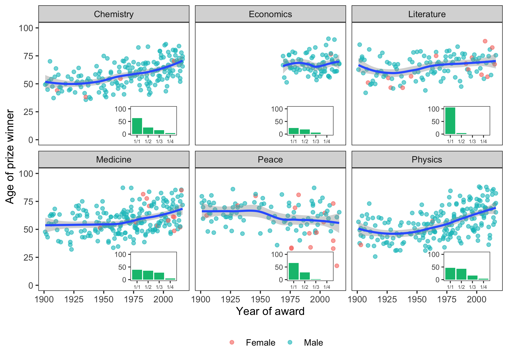

I recently spent some time working out how to include mini inset plots
within ggplot facets, and I thought I would share my code in case anyone
else wants to achieve a similar thing. 

<!--more-->

The resulting plot looks
something like this:



First let’s load some packages that are required for this example (and
for an easy life, in general):

``` r
## some essentials from the tidyverse
library(ggplot2)   ## for plotting
library(dplyr)     ## for data manipulation 
library(lubridate) ## for handling dates 
```

For this example, I’ll be playing with some Nobel Prize data. This
[dataset](https://github.com/rfordatascience/tidytuesday/tree/master/data/2019/2019-05-14)
was featured in the weekly
[\#TidyTuesday](https://twitter.com/search?src=typd&q=%23tidytuesday) R
community event, which is led by
[@thomas\_mock](https://twitter.com/thomas_mock) and
[@R4DSCommunity](https://twitter.com/R4DSCommunity), and
[catalogued](https://nsgrantham.shinyapps.io/tidytuesdayrocks/) by
[@nsgrantham](https://twitter.com/nsgrantham)

Start by reading in the data and adding the age of each laureate at the
time of the award, based on their birth date and the prize
year.

``` r
nobel <- read.csv("https://raw.githubusercontent.com/rfordatascience/tidytuesday/master/data/2019/2019-05-14/nobel_winners.csv")
plot_data <- 
  nobel %>% 
  mutate(prize_date = paste0(prize_year, "-12-10"),  
         age = time_length(interval(ymd(birth_date), ymd(prize_date)), "year")) %>%
  group_by(prize_year, laureate_id) %>%
  slice(1) %>%  ## make sure we have just one row per prizewinner per year
  ungroup()
```

The main plot will show how the age of winners has changed over time for
the six categories. Also presented - without comment - is the gender of
each laureate.

``` r
main_plot <- 
  ggplot(plot_data, aes(group=category)) + 
  geom_point(aes(x=prize_year, y=age, colour=gender), alpha=0.6) + 
  facet_wrap(~category) +  ## plot each prize category separately 
  theme_bw() +
  labs(y="Age of prize winner", x="Year of award") + 
  geom_smooth(aes(x=prize_year, y=age), method = "loess") + ## add a smoothed line
  scale_y_continuous(limits=c(0,100)) + 
  scale_colour_discrete(breaks=c("Female","Male")) +
  theme(panel.grid.major = element_blank(), 
        panel.grid.minor = element_blank(), 
        legend.position = "bottom",
        legend.title = element_blank()) 

main_plot
```


It looks like Nobel prize winners are getting older for all categories
other than Peace, which may be reassuring for those of us who are yet to
receive one…

As an example of the inset, let’s use a bar plot counting the number of
people sharing the prize each year.

``` r
## A function to plot the inset 
get_inset <- function(df){
  p <- ggplot(data=df %>% 
                group_by(category, prize_year) %>% 
                slice(1),
              aes(x=prize_share, fill=category)) +
    geom_bar() + 
    scale_x_discrete( drop=FALSE) + 
    scale_fill_manual(values = c("#00BF7D", "#A3A500", "#F8766D","#00B0F6","#E76BF3","#636363")) + 
    guides(fill=FALSE) +
    theme_bw(base_size=9) +  ## makes everything smaller
    theme(panel.background = element_rect(fill="white"),  ## white plot background 
          axis.title.y = element_blank(),
          axis.title.x = element_blank(),
          axis.text.x = element_text(size=rel(0.7)), ## tiny axis text
          panel.grid.major = element_blank(),
          panel.grid.minor = element_blank(),
          plot.background = element_blank())
  return(p)
}

inset_plot <- get_inset(plot_data) 
```

Adding this plot as an inset is easy using
[`annotation_custom`](https://ggplot2.tidyverse.org/reference/annotation_custom.html).
However, by definition, the annotation will be the same on every panel:

``` r
## Add it as an inset
main_plot +
    annotation_custom(grob=ggplotGrob(inset_plot), 
                      ymin = -8, ymax=34, xmin=1955, xmax=2015)
```


`ymin`, `ymax`, `xmin` and `xmax` define where the inset (the grob) will
be placed. This of course needs tweaking to find the right spot to avoid
covering any important parts of the data (like Malala)

When using facets, having the same plot on each facet is not very
informative.

To add different plots to each facet, I used a workaround modified from
this [StackOverflow
answer](https://stackoverflow.com/questions/37867758/insetting-on-facet-grided-and-grid-arrangeed-plot):

``` r
## This function allows us to specify which facet to annotate
annotation_custom2 <- function (grob, xmin = -Inf, xmax = Inf, ymin = -Inf, ymax = Inf, data) 
{
  layer(data = data, stat = StatIdentity, position = PositionIdentity, 
        geom = ggplot2:::GeomCustomAnn,
        inherit.aes = TRUE, params = list(grob = grob, 
                                          xmin = xmin, xmax = xmax, 
                                          ymin = ymin, ymax = ymax))
}
```

Use the `data` argument to place the inset on the relevant facet, either
by subsetting the actual data used to plot the inset, or just make a
dataframe containing the aestetic (`aes`) used to divide into facets
(here, it’s category).

``` r
main_plot +
    annotation_custom2(grob=ggplotGrob(inset_plot), 
                      data = data.frame(category="Chemistry"),
                      ymin = -8, ymax=34, xmin=1955, xmax=2015)
```


To do this for all the facets, I’ll use `split()` to divide the
dataframe into categories, and `map()` from the [`purrr`
package](https://purrr.tidyverse.org/) to apply our
`annotation_custom2()` function to each subset and return the results as
a list. See the StackOverflow for a solution using `plyr` instead, if
you prefer. This can then be added to the plot:

``` r
library(purrr)

insets <- plot_data %>% 
  split(f = .$category) %>%
  purrr::map(~annotation_custom2(
    grob = ggplotGrob(get_inset(.) +
                        scale_y_continuous(limits=c(0,105), breaks = c(0, 50, 100))), 
    data = data.frame(category=unique(.$category)),
    ymin = -8, ymax=34, xmin=1955, xmax=2015)
  )


main_plot + insets
```


We can now draw the groundbreaking conclusion that when it comes to
Nobel glory, Literature is a more solitary field than Medicine.

And now just for fun, while we’re here:

``` r
multiple_winners <- 
  plot_data %>% 
  group_by(laureate_id) %>% 
  filter(length(laureate_id) > 1)

main_plot + 
  insets +
  geom_point(data = multiple_winners, 
             aes(x=prize_year, y=age), shape = 1, alpha=0.7) +
  ggrepel::geom_text_repel(data = multiple_winners, 
                           aes(label=gsub(",.*$","",full_name), 
                               x=prize_year, y=age, group=full_name), 
                           size=2, force=10, nudge_y = 45, segment.size=0.15)
```


*This blog post was originally posted on the [OPIG blog](https://www.blopig.com/blog/https://www.blopig.com/blog/2019/08/combining-inset-plots-with-facets-using-ggplot2/).*
