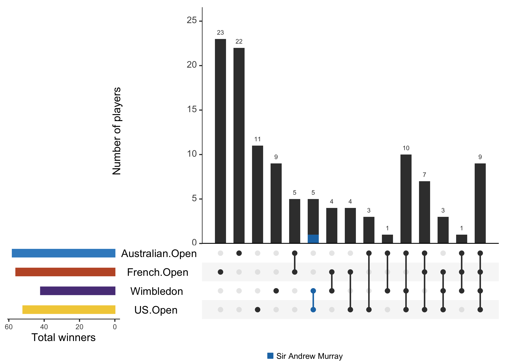
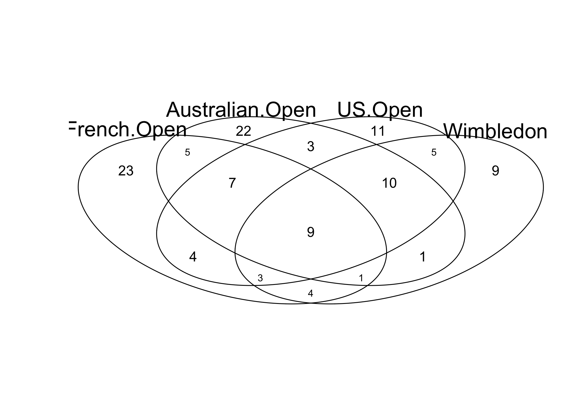
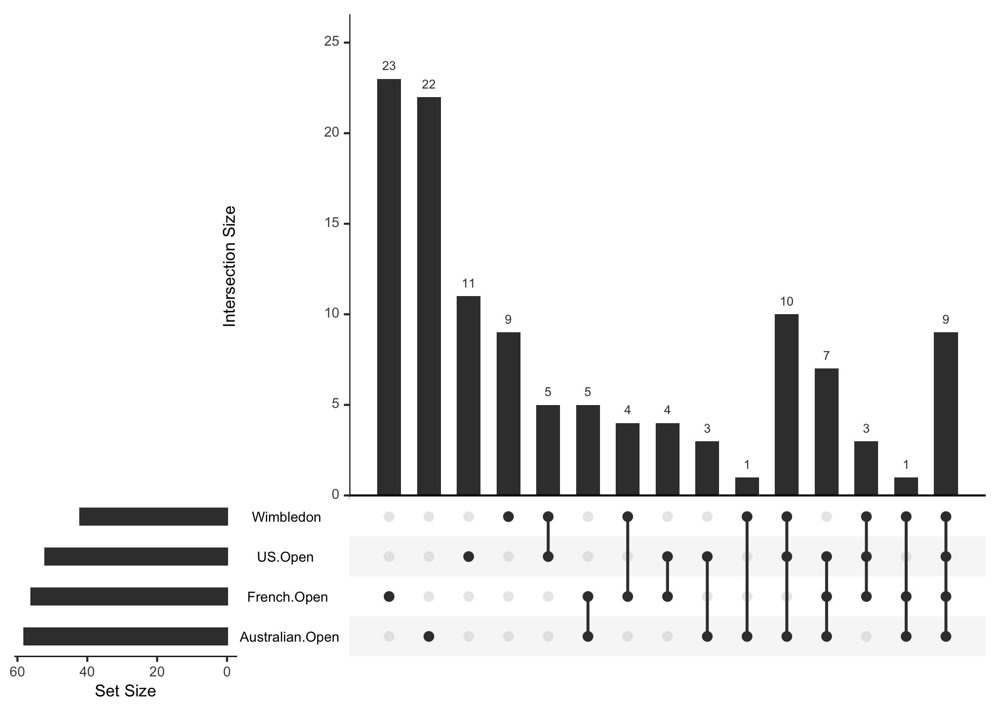
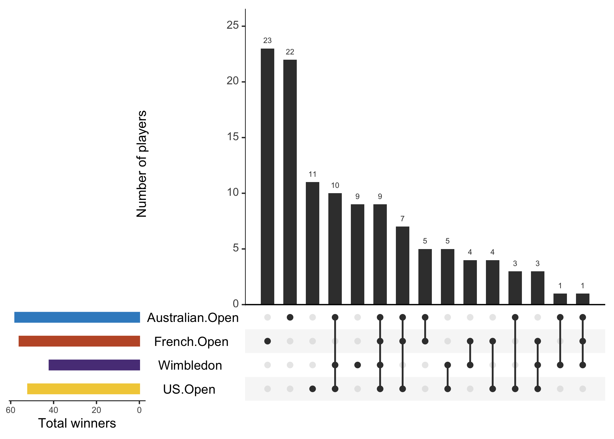
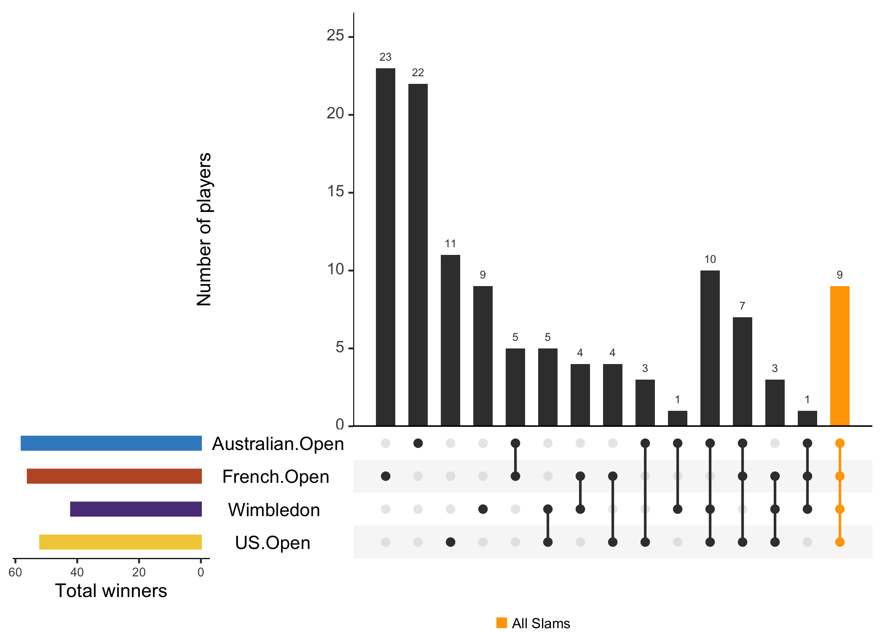
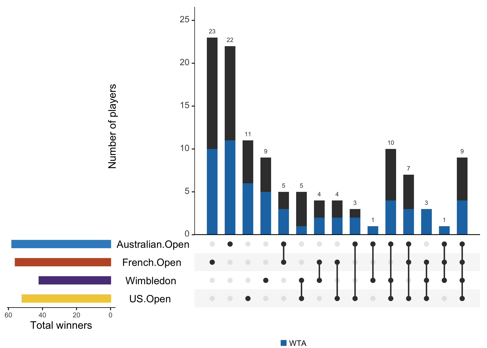
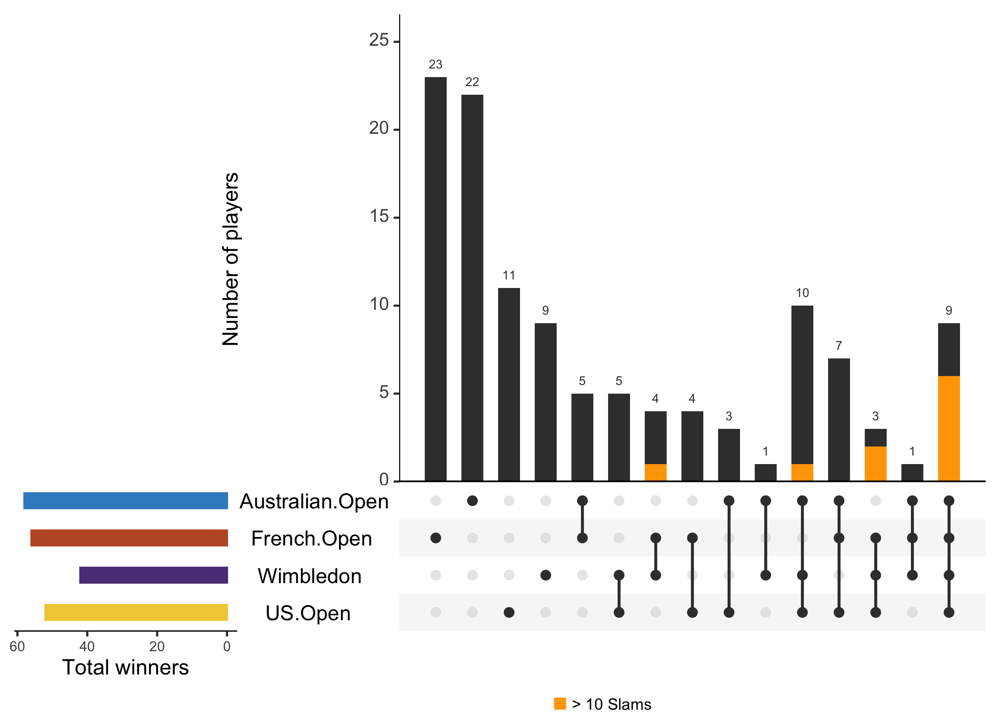
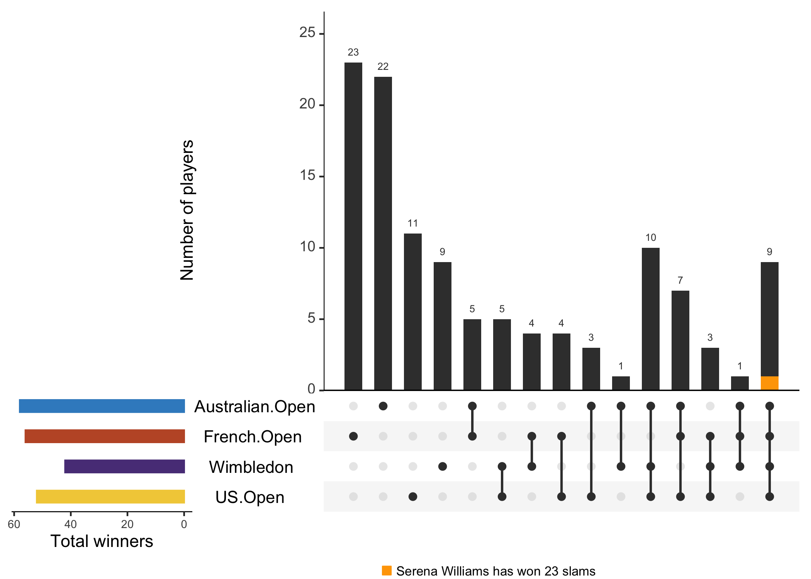

[`UpSetR`](https://cran.r-project.org/web/packages/UpSetR/readme/README.html)
is a package for visualising the intersections of many more sets than is
feasible with, for example, Venn diagrams. They are particularly useful
when there are many sets but the intersections are relatively sparsely
populated. In my research, I find these plots extremely powerful for
showing large amounts of information in an attractive and intuitive way,
with lots of options for exploring the data.

<!--more-->



The sets are shown as rows of a matrix at the bottom, with intersections
of sets indicated by connected filled circles, and the number of
corresponding elements shown as a bar plot above.

For this example, I’m going to use [some
data](https://github.com/clarewest//blog/blob/master/assets/slams.csv) on
tennis Grand Slam winners. The data was scraped
[from](https://en.wikipedia.org/wiki/List_of_Grand_Slam_women%27s_singles_champions)
[Wikipedia](https://en.wikipedia.org/wiki/List_of_Grand_Slam_mens%27s_singles_champions)
using [this python
script](https://github.com/clarewest//blog/blob/master/assets/grand_slam_wikipedia.py).

``` r
t <-
  read.csv(
    "https://raw.githubusercontent.com/clarewest//blog/master/assets/slams.csv",
    na.strings = "",
    stringsAsFactors = FALSE
  )
head(t)
```

    ##   Year Australian.Open      French.Open        Wimbledon          US.Open
    ## 1 1968            <NA>     Nancy Richey Billie Jean King    Virginia Wade
    ## 2 1969  Margaret Court   Margaret Court Ann Haydon-Jones   Margaret Court
    ## 3 1970  Margaret Court   Margaret Court   Margaret Court   Margaret Court
    ## 4 1971  Margaret Court Evonne Goolagong Evonne Goolagong Billie Jean King
    ## 5 1972   Virginia Wade Billie Jean King Billie Jean King Billie Jean King
    ## 6 1973  Margaret Court   Margaret Court Billie Jean King   Margaret Court
    ##     tour
    ## 1 Womens
    ## 2 Womens
    ## 3 Womens
    ## 4 Womens
    ## 5 Womens
    ## 6 Womens

In this dataframe, each row is a year, with the champion of each
tournament that year in separate columns, and a final column indicating
whether the row corresponds to the womens or the mens tour.

This is known as wide format, which is great for reading the data on
Wikipedia, but we need to reshape it before we can make any of the plots
I’m interested in today.

Previously I would have used `spread()` and `gather()`, but today I’ll
use the new generation equivalents, `pivot_longer()` and
`pivot_wider()`.

First I’ll put it in long format, in which each row is a tournament.

``` r
library(tidyr)
library(dplyr) 
t_long <-
  t %>%
  tidyr::pivot_longer(
    c(-Year,-tour),
    names_to = "Tournament",
    values_to = "Winner",
    values_drop_na = TRUE
  )

head(t_long)
```

    ## # A tibble: 6 x 4
    ##    Year tour   Tournament      Winner          
    ##   <int> <chr>  <chr>           <chr>           
    ## 1  1968 Womens French.Open     Nancy Richey    
    ## 2  1968 Womens Wimbledon       Billie Jean King
    ## 3  1968 Womens US.Open         Virginia Wade   
    ## 4  1969 Womens Australian.Open Margaret Court  
    ## 5  1969 Womens French.Open     Margaret Court  
    ## 6  1969 Womens Wimbledon       Ann Haydon-Jones

From this shape, we can look at, for example, how many times each player
has won each Slam:

``` r
t_long %>%
  group_by(Winner, Tournament) %>%
  summarise(Wins = length(Tournament)) %>%
  head()
```

    ## # A tibble: 6 x 3
    ## # Groups:   Winner [5]
    ##   Winner            Tournament       Wins
    ##   <chr>             <chr>           <int>
    ## 1 Adriano Panatta   French.Open         1
    ## 2 Albert Costa      French.Open         1
    ## 3 Amélie Mauresmo   Australian.Open     1
    ## 4 Amélie Mauresmo   Wimbledon           1
    ## 5 Ana Ivanovic      French.Open         1
    ## 6 Anastasia Myskina French.Open         1

Or how many different Slams each player has won at least once:

``` r
t_long %>%
  group_by(Winner, Tournament) %>%
  summarise(Wins = length(Tournament)) %>%
  count(name = "n_slams") %>%
  head()
```

    ## # A tibble: 6 x 2
    ## # Groups:   Winner [6]
    ##   Winner            n_slams
    ##   <chr>               <int>
    ## 1 Adriano Panatta         1
    ## 2 Albert Costa            1
    ## 3 Amélie Mauresmo         2
    ## 4 Ana Ivanovic            1
    ## 5 Anastasia Myskina       1
    ## 6 Andre Agassi            4

Today, I’m interested in how many players have won each combination of
Slams. As there are 4 tournaments, I can just about represent this using
a Venn diagram.

First, let’s reshape it back into wide format, but this time each row
will correspond to a player, with a 1 for each tournament they have won,
or a 0 for tournaments they haven’t, as well as the tour (Mens or
Womens) and the total number of slams they have won.

``` r
t_wide <-
  t_long %>%
  group_by(tour, Winner) %>%
  count(Tournament) %>% ## count how many wins at each tournament
  mutate(win = 1,  ## boolean for a win at the tournament
         Total = sum(n)) %>% ## count how many wins overall
  pivot_wider(
    c(id_cols = Winner, tour, Total),
    names_from = Tournament,
    values_from = win,
    values_fill = list(win = 0)
  ) %>% ## fill empty cells with 0
  data.frame()

head(t_wide) 
```

    ##            Winner tour Total French.Open Australian.Open US.Open Wimbledon
    ## 1 Adriano Panatta Mens     1           1               0       0         0
    ## 2    Albert Costa Mens     1           1               0       0         0
    ## 3    Andre Agassi Mens     8           1               1       1         1
    ## 4   Andrés Gimeno Mens     1           1               0       0         0
    ## 5    Andrés Gómez Mens     1           1               0       0         0
    ## 6     Andy Murray Mens     3           0               0       1         1

``` r
mat <-
  t_wide %>%
  dplyr::select(French.Open, Australian.Open, US.Open, Wimbledon)

gplots::venn(mat)
```


While Venn diagrams are useful for describing overlaps between sets,
they are limited in the number of sets they show, and the reliance on
numbers can make patterns tricky to spot.

Alternatively, we can visualise the same thing using an UpSet plot:

``` r
library(UpSetR)
upset(t_wide)
```



Cool\!

There are many ways to customise this. For example:

  - `keep.order`: keep the sets the same order rather than reordering by
    total count
  - `sets.bar.color`: change the colour of the bars on the left, which
    represent the total number of elements in each set (Slam winners)
  - `order.by`: reorder the intersection bars by the size (`freq`) or
    group by the sets involved (`sets`) instead of by the degree of
    intersecting sets
  - `sets.x.label`, `mainbar.y.label`: add axes titles
  - `text.scale`: adjust font size, either by providing a single
    integer, or vector in the format `c(intersection size title,
    intersection size tick labels, set size title, set size tick labels,
    set names, numbers above bars)`

See [this
vingette](https://cran.r-project.org/web/packages/UpSetR/vignettes/basic.usage.html)
for more
examples.

``` r
slam_colours = c("#3B8CC8", "#C05830", "#5A3E87", "#F2CE46") %>% ## slam colours (too cute, I know)
  rev()
tournaments = c("Australian.Open", "French.Open", "Wimbledon", "US.Open") %>% ## crucial order
  rev() ## reversed to be top to bottom

upset(
  t_wide,
  sets = tournaments,
  keep.order = TRUE,
  sets.bar.color = slam_colours,
  order.by = "freq",
  text.scale = c(1.3, 1.3, 1.3, 1, 1.5, 1),
  mainbar.y.label = "Number of players",
  sets.x.label = "Total winners",
)
```



Which highlights that, interestingly, the French Open and Wimbledon have
been won by the greatest diversity of players, while the rarest groups
are players that have won only Wimbledon & Australian Open, or all but
the US Open.

You can also query the data to highlight particular intersections
(`query = intersects`) or elements (`query = elements`) of interest.

Queries are passed as a list of lists.

For example, to highlight the intersection of all sets, representing
players that have won all four Grand Slams:

``` r
upset(
  t_wide,
  sets = tournaments,
  keep.order = TRUE,
  sets.bar.color = slam_colours,
  text.scale = c(1.3, 1.3, 1.3, 1, 1.5, 1),
  mainbar.y.label = "Number of players",
  sets.x.label = "Total winners",
  query.legend = "bottom",
  queries = list(
    list(
      query = intersects,
      params = list("French.Open", "Australian.Open", "US.Open", "Wimbledon"),
      active = T,
      query.name = "All Slams",
      color = "orange"
    )
  )
)
```



Or to highlight the elements that correspond to players on the Womens
Tour:

``` r
upset(
  t_wide,
  sets = tournaments,
  keep.order = TRUE,
  sets.bar.color = slam_colours,
  text.scale = c(1.3, 1.3, 1.3, 1, 1.5, 1),
  mainbar.y.label = "Number of players",
  sets.x.label = "Total winners",
  query.legend = "bottom",
  queries = list(
    list(
      query = elements,
      params = list("tour", "Womens"),
      active = T,
      query.name = "WTA"
    )
  )
)
```



See [this
vignette](https://cran.r-project.org/web/packages/UpSetR/vignettes/queries.html)
for more examples.

You can also subset your queries using `expression`.

Let’s highlight all the players that have won 3 total Slams, including
Wimbledon and the US Open:

``` r
upset(
  t_wide,
  sets = tournaments,
  keep.order = TRUE,
  sets.bar.color = slam_colours,
  text.scale = c(1.3, 1.3, 1.3, 1, 1.5, 1),
  mainbar.y.label = "Number of players",
  sets.x.label = "Total winners",
  query.legend = "bottom",
  queries = list(
    list(
      query = intersects,
      params = list("US.Open", "Wimbledon"),
      active = T,
      query.name = "Sir Andrew Murray"
    )
  ),
  expression = "Total == 3"
)
```


In addition to these built-in queries, it’s also possible to define your
own custom queries.

Let’s define a query `slams` that highlights the players who have won
more than a given number of total Slams

``` r
slams <- function(row, total) {
    data <- (row["Total"] >= total)
}

upset(
  t_wide,
  sets = tournaments,
  keep.order = TRUE,
  sets.bar.color = slam_colours,
  text.scale = c(1.3, 1.3, 1.3, 1, 1.5, 1),
  mainbar.y.label = "Number of players",
  sets.x.label = "Total winners",
  query.legend = "bottom",
  queries = list(
    list(
      query = slams,
      params = list(10),
      color = "orange",
      active = T,
      query.name = "> 10 Slams"
    )
  )
)
```



And as a reminder, who is the GOAT?

``` r
upset(
  t_wide,
  sets = tournaments,
  keep.order = TRUE,
  sets.bar.color = slam_colours,
  text.scale = c(1.3, 1.3, 1.3, 1, 1.5, 1),
  mainbar.y.label = "Number of players",
  sets.x.label = "Total winners",
  query.legend = "bottom",
  queries = list(
    list(
      query = slams,
      params = list(max(t_wide$Total)),
      color = "orange",
      active = T,
      query.name = paste0("Serena Williams has won ", max(t_wide$Total), " slams")
    )
  )
)
```

