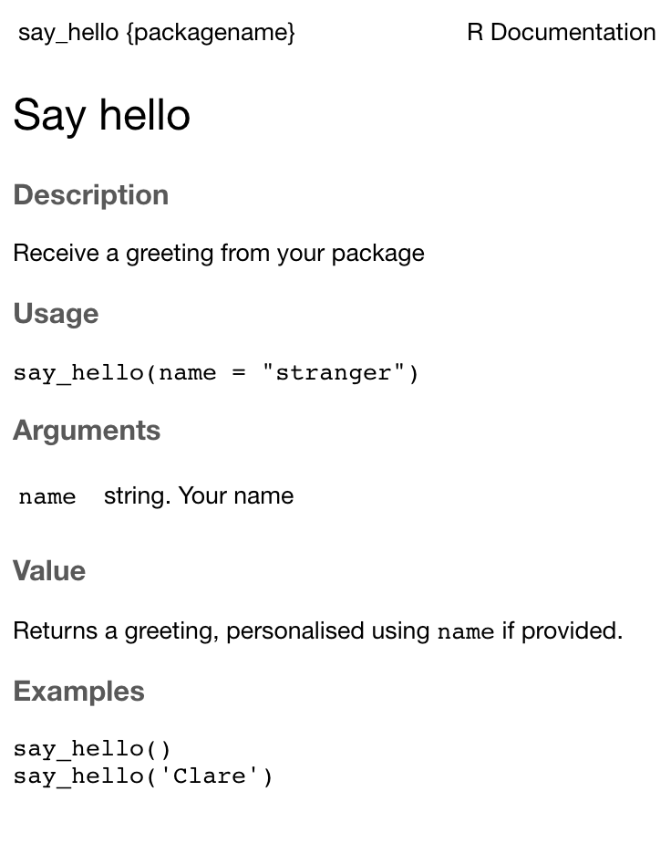

Packages are more than just a convenient way
to use methods and data sets developed by others in the community, and
to get your own out into the world. Creating a package is also
convenient way to collect your project in a tidy, documented, tested,
reproducible and shareable form. Not only that, but with the `usethis`
workflow package, the process is extremely easy and encourages good
coding practice.

<!--more-->

To get to grips with making R packages you need look no further than the
[R Packages](http://r-pkgs.had.co.nz/intro.html) book by Hadley Wickham.
Note that this is the 1st edition; the 2nd edition is [in development
here](https://r-pkgs.org/).

This blog post is basically a pre-digested overview to serve as a quick
introduction, or a refresher if – like me this week – you did it once a
while back but retrieving the details from your brain without notes is
an impossible and overwhelming task.

### Essential packages

  - `devtools`: preferably the development version, for the really good
    fresh stuff
  - `roxygen2`: for documenting your functions alongside the code
  - `testthat`: for including automated tests

<!-- end list -->

``` r
install.packages(c("roxygen2", "testthat"))
devtools::install_github("r-lib/devtools")
library(devtools)
library(roxygen2)
library(testthat)
```

### Creating the package

[`usethis`](https://usethis.r-lib.org/) is a workflow package for
setting up and developing R packages and projects, and is attached along
with `devtools`. Basically, `usethis` functions are used to automate the
creation and editing of files.

*Sidenote if you are reading the [R Packages](https://r-pkgs.org/) book:
lots of the `devtools` functions mentioned in the 1st edition of [R
Packages](http://r-pkgs.had.co.nz/intro.html) book are now part of the
`usethis` package since a [big update to
devtools](https://www.tidyverse.org/articles/2018/10/devtools-2-0-0/).*

For example, to start everything off:

``` r
usethis::create_package("~/packagename")
✓ Creating '/Users/me/packagename/'
✓ Setting active project to '/Users/me/packagename'
✓ Creating 'R/'
✓ Writing 'DESCRIPTION'
✓ Writing 'NAMESPACE'
✓ Writing 'packagename.Rproj'
✓ Adding '.Rproj.user' to '.gitignore'
✓ Adding '^packagename\\.Rproj$', '^\\.Rproj\\.user$' to '.Rbuildignore'
✓ Opening '/Users/me/packagename/' in new RStudio session
```

As you can see from the output, this will create the directory for the
package, including an Rstudio project, as well as metadata DESCRIPTION
and NAMESPACE files.

The DESCRIPTION file can be edited manually or via more `usethis`
functions, and looks like this to start off with:

    Package: packagename
    Title: What the Package Does (One Line, Title Case)
    Version: 0.0.0.9000
    Authors@R:
        person(given = "First",
               family = "Last",
               role = c("aut", "cre"),
               email = "first.last@example.com",
               comment = c(ORCID = "YOUR-ORCID-ID"))
    Description: What the package does (one paragraph).
    License: What license it uses
    Encoding: UTF-8
    LazyData: true

For example, use `use_package()` to add dependencies (i.e. packages that
your new package will require to work).

By default, this will be added as a dependency (`type = "imports"`). You
can use `type = "suggests"` to add it instead as a suggested package,
i.e. your package can take advantage of it, but it’s not required to
function.

Packages designated as imports will be installed along with your
package, if they aren’t already. Suggested packages, however, are not
automatically installed, so you should check whether they are installed
when they are called in the code.

``` r
> usethis::use_package("dplyr")
✓ Adding 'dplyr' to Imports field in DESCRIPTION
● Refer to functions with `dplyr::fun()`
usethis::use_package("cowplot", type = "suggests") 
✓ Adding 'cowplot' to Suggests field in DESCRIPTION
● Use `requireNamespace("cowplot", quietly = TRUE)` to test if package is installed
● Then directly refer to functons like `cowplot::fun()` (replacing `fun()`).
```

This will have added the following to the DESCRIPTION file. Note that
this file can also be edited manually, the `usethis` functions just make
it easy, as well as ensuring a regular format, including alphabetical
ordering.

    Imports: 
        dplyr
    Suggests: 
        cowplot

Some other useful set-up functions include setting the license and
creating a README.md file:

``` r
> usethis::use_mit_license()
✓ Setting License field in DESCRIPTION to 'MIT + file LICENSE'
✓ Writing 'LICENSE.md'
✓ Adding '^LICENSE\\.md$' to '.Rbuildignore'
✓ Writing 'LICENSE'

> usethis::use_readme_md()
✓ Writing 'README.md'
● Modify 'README.md'
```

These also update the relevant lines in the DESCRIPTION file.

### R code:

Code is stored in R scripts in an `R/` directory.

Use the `use_r()` function to create an `.R` file (and the `R/`
directory if it does not already exist). Edit the file to add a
function. Then, load the package, and the functions are ready to use.

``` r
> usethis::use_r("hello")
● Modify 'R/hello.R'
● Call `use_test()` to create a matching test file

## Add a function into hello.R
say_hello <- function(name="stranger"){
  print(paste("Hello, ", name, "!", sep=""))
}

## Load the package
> devtools::load_all()
Loading packagename

> packagename::say_hello()
[1] "Hello, stranger!"

> packagename::say_hello("Clare")
[1] "Hello, Clare!"
```

Note that it’s not possible to have subdirectories, so if files need to
be grouped use a common prefix: `prefix-*.R`

To display a message when the package loads, use `.onAttach()`

``` r
.onAttach <- function(libname, pkgname) {
  packageStartupMessage("Welcome to my package")
}
```

### Using Git and Github

Version control of your project using Git is good practice, and also a
requirement for some of the `usethis` functions, as they are modifying
files in your project directory.

Configure your Github
settings:

``` r
usethis::use_git_config(user.name = "Your Name", user.email = "yourgithubemail@example.com")
```

Which is the equivalent of:

``` bash
git config --global user.name 'Your Name'
git config --global user.email 'yourgithubemail@example.com'
git config --global --list
```

Initiate a git repository using `use_git()`, which will create a repo
and ask if you would like to commit the files. If you’re using RStudio,
you can also benefit from the Git panel.

``` r
> usethis::use_git()
There are 2 uncommitted files:
* 'DESCRIPTION'
* 'README.md'
Is it ok to commit them?
1: No way
2: Absolutely
3: Nope
```

Connecting to your GitHub account for pulling and pushing requires some
extra authentication, and allows you to use
[`use_github`](https://usethis.r-lib.org/reference/use_github.html).

### Documenting your package

One of the benefits of creating packages in R is the ease of automating
documentation and tests as you go.

The standard method to document objects in an R package involves `.Rd`
files in the `man/` directory, which use a custom LaTeX-like syntax and
are rendered for viewing in HTML, plain text and pdf form.

`roxygen2` converts specially formatted comments in `.R` source files
into `.Rd` files, automating all the boring parts. `roxygen2` comments
begin with `#'` to distinguish them from regular comments, and the
conversion is called using `devtools::document()`

For example, let’s document our `say_hello()` function:

    #' Say hello
    #'
    #' Receive a greeting from your package
    #'
    #' @param name string. Your name
    #' @return Returns a greeting, personalised using \code{name} if provided.
    #' @examples
    #' say_hello()
    #' say_hello('Clare')
    #' @export
    say_hello <- function(name="stranger"){
      print(paste("Hello, ", name, "!", sep=""))
    }

The first sentence is the title of the function, followed on the third
line (after a blank `#'`) by a paragraph description of the function.

  - `@param` tag documents the arguments to the function. Each argument
    should be documented with a line including the argument name and a
    description of the argument, including the expected type.
  - `@return` tag describes what should be returned by the function
    (which may be `None`)
  - `@examples` provides executable example code demonstrating how to
    use the function. These examples are executed automatically as part
    of the `R CMD` check so they must run without errors; to include
    code that shouldn’t run, wrap it in `\dontrun{}`
  - `@export` instructs `roxygen2` to export the function to the
    NAMESPACE file, which means the function can be used by package
    users, rather than just internally within the package

Run `devtools::document()` to convert roxygen comments to `.Rd` files

``` r
> devtools::document()
Updating packagename documentation
Loading packagename
Writing NAMESPACE
Writing say_hello.Rd
```

Which generates the following `.Rd` file:

    % Generated by roxygen2: do not edit by hand
    % Please edit documentation in R/hello.R
    \name{say_hello}
    \alias{say_hello}
    \title{Say hello}
    \usage{
    say_hello(name = "stranger")
    }
    \arguments{
    \item{name}{string. Your name}
    }
    \value{
    Returns a greeting, personalised using \code{name} if provided.
    }
    \description{
    Receive a greeting from your package
    }
    \examples{
    say_hello()
    say_hello('Clare')
    }

You can now view the documentation in RStudio as usual using
`?say_hello`:

    > ?say_hello
    Rendering development documentation for 'say_hello'



### Automating tests

Finally, we can set up automated tests using `testthat`.

``` r
> usethis::use_testthat()
✓ Adding 'testthat' to Suggests field in DESCRIPTION
✓ Creating 'tests/testthat/'
✓ Writing 'tests/testthat.R'
● Call `use_test()` to initialize a basic test file and open it for editing.
```

As indicated, this creates a directory for the tests and a script
`tests/testthat.R` that will run all the tests that we write.

To read more about how and why to write tests for R packages, I
recommend the [relevant chapter of Hadley Wickham’s R
Packages](https://r-pkgs.org/tests.html).

Basically, each test file consists of one or more test functions, which
are made up of expectations. Expectations are binary assertiation
functions of the form `expectation_*`, which are passed two arguments:
the actual result and what you expect.

[It is
recommended](https://www.tidyverse.org/blog/2019/04/testthat-2-1-0/#context-is-now-optional)
to use the same structure in your `tests/testthat/` directory as your
`R/` directory, i.e., a test file for every `.R` file.

Examples of expectations include:

``` r
expect_equal() 
expect_match() ## character vector against a regular expression

## second argument is not required for these, but use to be explicit
expect_output() ## inspects printed output
expect_message() ## inspects message
expect_warning() ## inspects warning
expect_error() ## inspects error

expect_is() ## checks that an object is of an expected class

expect_true()
expect_false()
```

As an example, let’s use `use_test()` to create a file for our `hello.R`
file, and write a text for our `say_hello()` function:

``` r
> usethis::use_test("hello")
✓ Writing 'tests/testthat/test-hello.R'
● Modify 'tests/testthat/test-hello.R'
```

Modify the test file:

``` r
test_that("returns string", {
  expect_output(say_hello(), "Hello, stranger!")
})
```

Run the tests using `devtools::test()`:

``` r
> devtools::test()
Loading packagename
Testing packagename
✓ |  OK F W S | Context
✓ |   1       | hello

══ Results ══════════════════════════════════════════════════════════════════════════════════════════════════════════════════════════════
OK:       1
Failed:   0
Warnings: 0
Skipped:  0
```

Success\!

Finally, we can check the package using `devtools::check()` and install
it using `devtools::install()`

``` r
> devtools::check()
── R CMD check results ────────────────────────────────────────────────────────────────────────────────────── packagename 0.0.0.9000 ────
Duration: 9.3s

0 errors ✓ | 0 warnings ✓ | 0 notes ✓

> devtools::install()
* installing *source* package ‘packagename’ ...
...
* DONE (packagename)
```
