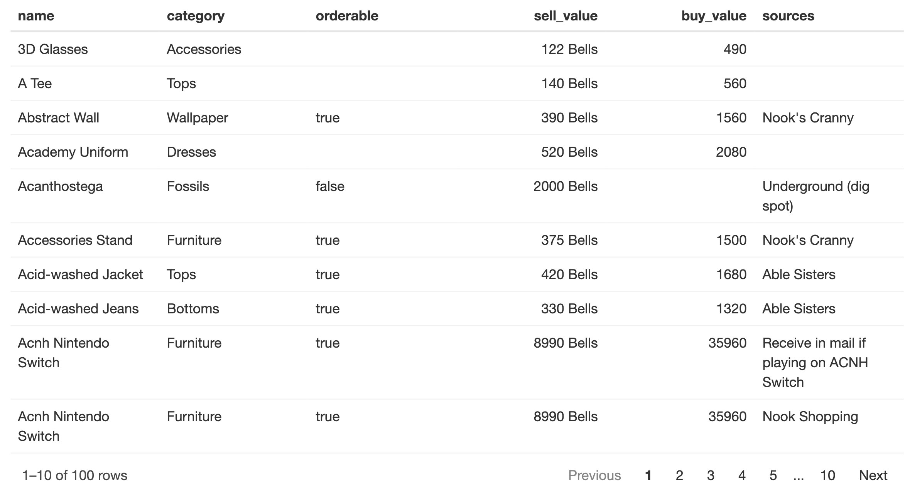

```{r setup, include=FALSE}
knitr::opts_chunk$set(echo = TRUE, message = FALSE, warning = FALSE)
library(shiny)
```

In this blog post I demonstrate the basics of each package, with some formatting examples. All three are nice, but I have a preference for DT because it's quick and highly customisable. I include some extra DT examples including how to include icons, images, tooltips, heatmap-style column fills, abbreviated column output, and how to make very simple tables.

<!--more-->

We all know that plots and visualisations are great ways to summarise, interpret and present data. However, sometimes you need something that no plot can ever achieve: nitty gritty detail. 

Tables! Underappreciated data analysis heroes. 

I auditioned three packages for making nice tables in Shiny apps: `DT`, `formattable` and `reactable`.

The data I'll use today is the Animal Crossing dataset from [VillagerDB](https://github.com/jefflomacy/villagerdb) via [Tidy Tuesday](https://github.com/rfordatascience/tidytuesday/blob/master/data/2020/2020-05-05/readme.md). 

```{css, echo = FALSE}
h2, .h2, h3, .h3 {
    margin-top: 40px;
}

h4, .h4, h5, .h5 {
    margin-top: 40px;
}

```

```{r}
library(dplyr)
items <-
  readr::read_csv(
    'https://raw.githubusercontent.com/rfordatascience/tidytuesday/master/data/2020/2020-05-05/items.csv'
  ) %>% select(-num_id,-sell_currency,-buy_currency,-games_id,-id_full) %>%
  unique() %>%
  head(100)  
villagers <-
  readr::read_csv(
    'https://raw.githubusercontent.com/rfordatascience/tidytuesday/master/data/2020/2020-05-05/villagers.csv'
  ) %>% 
  select(-row_n) %>% 
  unique()

```

## DT

[`DT`](https://rstudio.github.io/DT/) is an interface to the JavaScript library [DataTables](https://datatables.net/). It allows you to display R dataframes (or matrices) as interactive tables in HTML pages, such as in a Shiny app. 

The most basic way to use it is the function `datatable(df)`:


```{r}
library(DT)
datatable(villagers[,1:8])

```

<br>

The resulting table already has really user-friendly features including pagination, searching, and sortable columns. 

The tables are really customisable. Note that while some customisation options belong as arguments to `datatable`, many others are 'initialisation options' that are passed to the `options` argument as named elements of a list. These are passed to DataTables and interpreted as JS code. More details about how these are implemented in DT is [here](https://rstudio.github.io/DT/options.html) and a full list of the options available in DataTables can be found in the  [DataTables documentation](https://datatables.net/reference/option/). 

Here are some options that I find useful:

```{r}

datatable(villagers,
  options = list(paging = TRUE,    ## paginate the output
                 pageLength = 15,  ## number of rows to output for each page
                 scrollX = TRUE,   ## enable scrolling on X axis
                 scrollY = TRUE,   ## enable scrolling on Y axis
                 autoWidth = TRUE, ## use smart column width handling
                 server = FALSE,   ## use client-side processing
                 dom = 'Bfrtip',
                 buttons = c('csv', 'excel'),
                 columnDefs = list(list(targets = '_all', className = 'dt-center'),
                                   list(targets = c(0, 8, 9), visible = FALSE))
                 ),
  extensions = 'Buttons',
  selection = 'single', ## enable selection of a single row
  filter = 'bottom',              ## include column filters at the bottom
  rownames = FALSE                ## don't show row numbers/names
)

```

##### Server or client side processing

The `server` argument determines whether the data is processed on the server side or the client (browser) side. If `server = TRUE` (the default), the browser receives only the displayed data. If `server = FALSE` the browser receives all the data, which can  slow it down if the dataset is large.

##### Data download buttons

The combination of `extensions = 'Buttons'` with `buttons = c('csv', 'excel')` and `dom = 'Bfrtip'` (in the list passed to `options`) creates buttons that allow the user to download the data table in csv or excel format. The data that is downloaded will be either the currently visible data or the entire table, depending on the `server` option. 

##### Dom
The `dom` option defines the position of elements around the table. 
'Bfrtip' is a combination of elements - `B`utton, `f`ilter, p`r`ocessing display element, `t`able, table `i`nformation summary, `p`agination control. The order of the characters determines the layout of the elements around the table. Full documentation is [here](https://datatables.net/reference/option/dom). 

##### Scrolling options
`scrollX` and `scrollY` enable scrolling when the table wider or longer than the display.

##### Change page length
When `pagination = TRUE`, change the number of rows per page with `pageLength`

##### Row selection
`selection = 'single'` enables the user to select a single row at a time by clicking. The default value is `multiple`, enabling the selection of multiple rows, and `none` disables selection. By default, the selected rows are highlighted in blue, and within an interactive Shiny app the indices of selected rows can be accessed by using `input$tableID_rows_selected` in server.R.

##### Column defs
`columnDefs` is used to assign specific options to columns. In this example, I set all columns (`targets = '_all'`) to be centre-aligned (`className = 'dt-center'`). I also hide (`visible = FALSE`) column 1, 9 and 10 (`targets = c(0, 8, 9)`).  

##### Column filters
The `filter` argument determines whether to add a filter (search bar) for columns, and where to put it. Other options are `none` and `top`, and you can also control the style (see documentation). 


## Using DT::datatable in a Shiny app:

Here's an example of how to use `DT::datatable` in a Shiny app:

```{r, eval = FALSE}
library(shiny)

ui <- fluidPage(titlePanel("DT table in Shiny"),
                mainPanel(width = 12,
                          DT::dataTableOutput("mytable")))

server <- function(input, output) {
  output$mytable <- DT::renderDataTable(villagers,
                                        options = list(scrollX = TRUE),
                                        rownames = FALSE)
}

# Run the application
shinyApp(ui = ui, server = server)

```

### DT and HTML

The Shiny function `icon()` can be used to generate icons from [fontawsome](https://fontawesome.com/icons?from=io) and [glyphicons](https://www.glyphicons.com/sets/basic/). 


```{r}
icon("thumbs-up", lib = "font-awesome")

```

<br>

`as.character()` reveals the underlying HTML:

```{r}
as.character(icon("thumbs-up", lib = "font-awesome"))
```

<br> 

You can put HTML elements, such as these icons, in the dataframe and they will be displayed in the DT datatable, as long as the `escape = FALSE` option is set. The default, `escape = TRUE`, escapes the HTML elements and displays the underlying HTML code - this is because unexpected HTML entities can potentially be a security issue. 


```{r}
icon_villagers <- villagers %>%
  mutate(gender = ifelse(gender == "female",
                         as.character(icon("venus", lib = "font-awesome")),
                         as.character(icon("mars", lib = "font-awesome"))))
datatable(icon_villagers[,1:8],
          options = list(scrollX = TRUE),
          escape = FALSE)

```

<br> 

I like to include a tooltip with a hoverable explanation over pictures and icons in my tables. 

Any image can be a cute icon if you make it small enough! I'm going to use the villager pictures here.

Use the [HTML `` tag](https://www.w3schools.com/tags/tag_img.asp) to include an image. Include the URL with `src="url_here.png`, change the size with `height`, add a tooltop with `data-toggle="tooltip"`, `data=placement="right"`, and the label with `title="Text goes here"`. Remember to escape the special characters. 

```{r}
pic_villagers <- villagers %>%
  mutate(
    picture = paste0(
      "</img>"
    )
  ) %>%
  select(picture, name, gender, species, birthday, personality, phrase) %>%
  unique()

datatable(pic_villagers,
          options = list(scrollX = TRUE),
          escape = FALSE,
          rownames = FALSE)
```

## formattable

Another nice table-making package is [`formattable`](https://renkun-ken.github.io/formattable/).

The cute heatmap-style colour formatting and the easy-to-use formatter functions make `formattable` very appealing. 

`color_tile()` fills the cells with a colour gradient corresponding to the values

`color_bar()` adds a colour bar to each cell, where the length is proportional to the value

The `true_false_formatter()` defined below demonstrates how to define your own formatting function, in this case formatting `TRUE`, `FALSE` and `NA` as green, red and black.

```{r}
library(formattable)

## Prepare the item data
pic_items <- items %>%
  mutate(picture = ifelse(!is.na(image_url), 
                          paste0("</img>"), 
                          as.character(icon("question", lib = "font-awesome")))) %>%
    select(picture, name, category, orderable, sell_value, buy_value) %>%
  unique()

## A formatter function to format TRUE/FALSE values
true_false_formatter <-
  formatter("span",
            style = x ~ style(
              font.weight = "bold",
              color = ifelse(x == TRUE, "forestgreen", ifelse(x == FALSE, "red", "black"))
            ))

## Use formattable
formattable(
  head(pic_items),
  list(
    ## colour this column in a white to pink gradiant by value
    `sell_value` = color_tile("white", "pink"),
    
    ## a coloured bar with length proportional to value
    `buy_value` = color_bar("lightblue"),
    
    ## use custom formatter for TRUE/FALSE values
    orderable = true_false_formatter
  )
)

```

### Why not both? Combining `DT` and `formattable`

If you want the features of both `DT` and `formattable`, you can combine them by converting the `formattable()` output to `as.datatable()`, and much of the formattable features will be preserved. 

However, one problem I had was that when using `DT::datatable`, missing values (`NA`) are left blank in the display (which I prefer), but in the converted from `formattable()` version, NA's are printed. Also, `color_bar` columns seem to be converted to character, which can no longer be sorted numerically. 

```{r}
formattable(
  pic_items,
  list(
    `sell_value` = color_tile("white", "pink"),
    `buy_value` = color_bar("lightblue"),
    orderable = true_false_formatter
  )
) %>%
  as.datatable(escape = FALSE,
               options = list(scrollX = TRUE),
               rownames = FALSE)
```

## reactable

Next I tried [`reactable`](https://glin.github.io/reactable/), a package based on the [React Table](https://github.com/tannerlinsley/react-table) library. 


```{r, eval = FALSE}
library(reactable)
reactable(items[, 2:7],
          columns = list(
            sell_value = colDef(align = "right",
                                na = "-",
                                format = colFormat(suffix = " Bells"))
          ))
```



<br> 

Like `DT`, pagination and sorting is enabled by default. 

Columns are customised via the `columns` argument, which takes a named list of column definitions defined using `colDef()`. These include `format` definitions created using `colFormat`. 

An overview of the customisation options can be found [here](https://glin.github.io/reactable/articles/examples.html). 


## Final thoughts

In the end, I used `DT::datatable()` in my Shiny app, because I found it the easiest, fastest, and most comprehensive. I've been able to achieve most of the features I wanted using just `DT`. 

Here are some final tips for using DT with Shiny:


### Heatmap-like fill effect:

First we define the breaks and colours for the fill gradient. The cost of items ranges from 5 to 320,000 (excluding two huge outliers at 1,000,000 and 1,200,000). 

```{r}
## Colour and values for table colour formatting
brks <- seq(5, 320000, 1000)
clrs <- colorRampPalette(c("white", "#6baed6"))(length(brks) + 1)
```

<br> 

Then we apply the `formatStyle()` function to the output of `datatable()` to set the `backgroundColor` for selected columns:

```{r}
datatable(pic_items,
          options = list(scrollX = TRUE,
                         order = list(list(5, 'desc'))),
          escape = FALSE,
          rownames = FALSE) %>%
      formatStyle(c("sell_value", "buy_value"), backgroundColor = styleInterval(brks, clrs))

```

### Abbreviate long cells

Sometimes some cells have a large amount of text that would mess up the table layout if I showed it all. In these cases, I like to abbreviate long values and show the full text in a tooltip.

To do this, you can use JavaScript to format the column to show a substring with "..." and the full string in a tooltip (`<span title="Long string">Substring...</span`) when values are longer than N characters (in this case 10 characters). You can do this using `columnDefs` and pass JavaScript with the `JS()` function:


```{r}

datatable(pic_items,
          options = list(scrollX = TRUE,
                         columnDefs = list(
                                       list(
                                         targets = 1,
                                         render = JS(
                "function(data, type, row, meta) {",
                "return type === 'display' && data.length > 10 ?",
                "'<span title=\"' + data + '\">' + data.substr(0, 10) + '...</span>' : data;",
                "}")))),
          escape = FALSE,
          rownames = FALSE)
```


### Really plain table

Sometimes I don't need any of the faff. Here's how to get rid of it all:
```{r echo = FALSE}
rate <- function(score){
  paste(rep("<i class=\"fa fa-heart\"></i>", score), collapse = "")
}
my_villagers = data.frame(name = c("Daisy", "Ellie", "Roald", "Marina", "Bubbles", "Drake", "Eugene", "Blanche", "Julia"),
                          rating = c(rate(4), rate(3), rate(5), rate(3), rate(6), rate(3), rate(4), rate(4), rate(3)))
my_pic_villagers <- villagers %>%
  mutate(picture = paste0("</img>"),
         species = paste(personality, species)) %>% 
  inner_join(my_villagers) %>% 
  select(picture, name, species, rating)

```

```{r}

headerCallbackRemoveHeaderFooter <- c(
  "function(thead, data, start, end, display){",
  "  $('th', thead).css('display', 'none');",
  "}"
)

datatable(
  my_pic_villagers,
  options = list(
    dom = "t",
    ordering = FALSE,
    paging = FALSE,
    searching = FALSE,
    headerCallback = JS(headerCallbackRemoveHeaderFooter)
  ),
  selection = 'none',
  callback = JS(
    "$('table.dataTable.no-footer').css('border-bottom', 'none');"
  ),
  class = 'row-border',
  escape = FALSE,
  rownames = FALSE,
  filter = "none",
  width = 500
)

```

