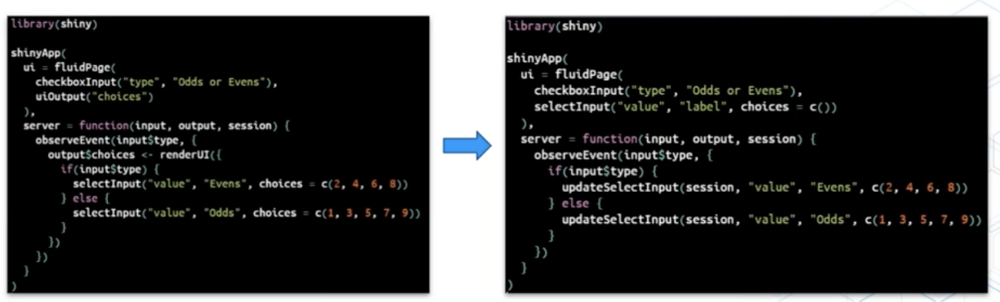
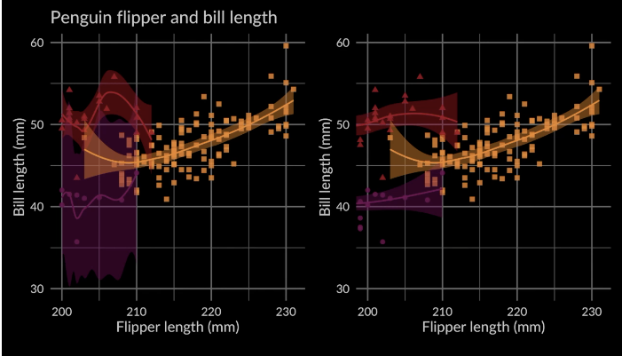
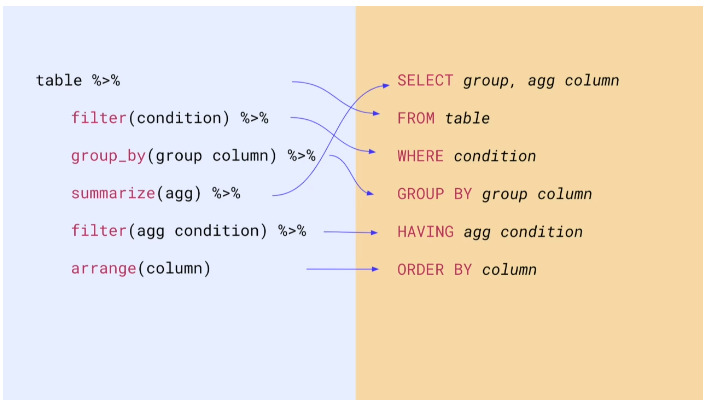
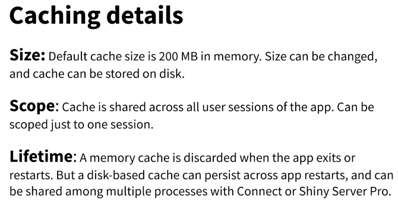

rstudio's annual conference went online and global this year, which meant that I could attend for the first time. There were lots of interesting talks, and it was great to see familiar faces from GitHub/Twitter avatars come to life! This is a summary of the notes I took during the talks I attended, I will add links to the full talks on the rstudio website when they become available.

```{r setup, include=FALSE}
knitr::opts_chunk$set(echo = TRUE)
devtools::source_gist("c83e078bf8c81b035e32c3fc0cf04ee8", 
                      filename = 'render_toc.R')
```

```{css, echo = FALSE}
h2, .h2, h3, .h3 {
    margin-top: 30px;
}

h4, .h4, h5, .h5 {
    margin-top: 30px;
}

```

```{r toc, echo=FALSE}
render_toc("index.Rmd")
```

### Speeding up Shiny, *Pedro Silva* {#speeding-up-shiny}
*Use update functions for faster Shiny apps*

[Update functions](https://mastering-shiny.org/action-dynamic.html) speed up Shiny apps by telling the browser to update an existing element, rather than replacing it completely. Shiny inputs each have a corresponding update function, and just this small change in the code can achieve large speed improvements per element (e.g. from ~15ms to ~10ms for the example below). For more complicated widgets such as `DT::datatable`, proxy functions should be used instead. 

<div class="figure">


<p class="caption"> How to use an update function</p>

</div>


### Shiny Open Source, *Dominik Krzemiński* {#shiny-open-source}
*Dominik Krzemiński shared some of his favourite Shiny packages*

- [`ShinyJS`](https://deanattali.com/shinyjs/): Perform common useful JavaScript actions in Shiny e.g. hiding elements, disabling input, delaying code execution
- [`shinyWidgets`](http://shinyapps.dreamrs.fr/shinyWidgets/): a big collection of nice, well-documented components to enhance apps
- [`bs4Dash`](https://rinterface.github.io/bs4Dash/) - bootstrap skins for Shiny apps
- [`shinyMobile`](https://rinterface.github.io/shinyMobile/) - helps create mobile-ready apps
- [`shiny.semantic`](https://github.com/Appsilon/shiny.semantic) - create an alternative look for Shiny apps
- [`ShinyCSSLoaders`](https://github.com/daattali/shinycssloaders): Easily allows you to add loading animations to the outputs instead of greying them out, with just:
```R
shinycssloaders::withSpinner(
  plotOutput("plot")
)
```
He also highlighted the [nanxstats/awesome-shiny-extensions](https://github.com/nanxstats/awesome-shiny-extensions) GitHub repo from [Nan Xiao](https://twitter.com/nanxstats) (sidenote: also the author of the theme I use for this blog!)

### Best practices in developing Shiny apps, *Olga Mierzwa-Sulima* {#shiny-best-practices}
- [**shiny modules**](https://shiny.rstudio.com/reference/shiny/1.5.0/moduleServer.html) enable you to decompose your application, providing encapsulation, modularity, reusability, and the ability to test components. 
- [**R6 classes**](https://adv-r.hadley.nz/r6.html) provide an implementation of object-orientated programming in R. It introduces a clear system of getting the current state, operations, auxiliary functions and initial state of the object. Keep each class in a separate script, and store scripts in a directory separated from other code. 
- **wahini/modules** is an organisational unit for source code. It enforces rigour when defining dependencies, as you have to explicitly declare which functions or packages your code is using. 
- [**lintr**](https://github.com/jimhester/lintr) ensures high quality, automated tests through e.g. GitHub actions. 
- [**Project templates**](https://rstudio.github.io/rstudio-extensions/rstudio_project_templates.html) mean you don't have to start from scratch every time - instead initialise project repos from a template that includes a simple shiny app with shiny modules, modules, unit tests and automatic tests set up
- **Development environments** prevent projects interfering with each other and ensures the code produces the same result on different machines. Olga recommends Docker and [`renv`](https://rstudio.github.io/renv/articles/renv.html) for managing dev environments. 
- **Testing** is important - set up testing architecture early (start from a project template) so that you don't forget, write at least some tests for each piece of code, and don't accept pull requests that do not include or pass tests. Data validation should have the most tests. Olga recommends the `data.validator` package, which automatically generates reports from the tests. 
- **Hallway usability test** - get someone passing in the hallway to use the app. With five people, you can learn 85% of what there is to learn about usability problems!

### Scaling Shiny to thousands of users, *Damian Rodziewicz* {#scaling-shiny}
*Why Shiny apps get slow with many users and how to fix it*

Shiny is slower with more users because they share the servers. R is single-threaded, so when multiple users are sharing a single process, while one user does something, the other user cannot do anything. Each process uses the memory required for the application, so the amount of memory required scales with the number of users and processes. 

Speeding up Shiny servers by adding more CPU/memory or more servers is easy but costly. Slimming the Shiny app is more difficult and requires an understanding of why the application is slow, in order to identify bottlenecks and speed them up. 

Four ways to scale Shiny apps:

- Leverage the frontend (less CPU useage) - this means you don't use the server to generate HTML that is sent back to the server
- Extract computations (less CPU useage) - if the app is doing something heavily, think about a way to extract it somewhere else
- Use a database (less memory and CPU usage) - query data from a database instead of reading it into memory
- [Tune one server](https://support.rstudio.com/hc/en-us/articles/231874748-Scaling-and-Performance-Tuning-in-RStudio-Connect) or add more servers 

Extra: I also saw this great tip on Damian's Twitter:

<blockquote class="twitter-tweet tw-align-center"><p lang="en" dir="ltr">Tired of working in shiny and rerunning the app every time you do a change? Checkout options(shiny.autoreload = TRUE)</p>&mdash; Damian Rodziewicz (@D_Rodziewicz) <a href="https://twitter.com/D_Rodziewicz/status/1336582721934684160?ref_src=twsrc%5Etfw">December 9, 2020</a></blockquote> <script async src="https://platform.twitter.com/widgets.js" charset="utf-8"></script>

### Maintaining the house the tidyverse built, *Hadley Wickham* {#maintaining-the-tidyverse}
*The tidyverse life cycle and how to not have your code broken by updates*

Tidyverse updates bring improvements, new features and bug fixes, but sometimes they can introduce problems with existing R code. Hadley Wickham gave an overview of the Tidyverse life cycle, which tries to mitigate these problems. These are labels that indicate the stages of development, and can apply to functions, packages, arguments, and specific values of arguments.

- **Experimental** - code that will change based on feedback
- **Stable** - no plans to change, developers will avoid making breaking changes to this code
- **Deprecated** - this was a bad idea, and you should stop using it, e.g. `tibble::data_frame()` replaced with `tibble()`
- **Superceded** - replaced with a new approach, development is complete and the code won't be updated, but will continue to be maintained indefinitely. You should use best practice in new code and teaching, but superceded code will still be functional and won't be removed. E.g. `gather()` and `spread()`, now superceded by `pivot_longer()` and `pivot_wider()`. 

"Breaking changes" include removing functions or arguments, restricting allowed inputs, or changing types of output. "Non-breaking changes" include adding arguments and functions, as well as fixing bugs; note that bug-fixes may still break code that inadvertantly depends on the bug. 

Breaking changes will happen gradually via deprecation. There will be a warning (not an error) printed once every eight hours to let you know that the function is deprecated, along with a guide for what to use instead. 

Developers will anticipate breaking changes by checking how code is used in CRAN and on GitHub, and try to fix these issues for cases that are widely used. CRAN packages have extra protection against breaking changes, as all the tests are rerun before updates. 

Off-label useage of functions refers to the use of functions for purposes not intended by the author. This should be avoided, as it is difficult to follow your intentions when reading code, and the author cannot anticipate your specific useage, making it more likely that updates may introduce problems with your code. The best way to avoid off-label useage is to read the documentation. 

Opting out of updates is generally not a good idea, but can be useful to protect unattended code e.g. code in production. 

You can use [`renv`](https://rstudio.github.io/renv/articles/renv.html) to isolate projects. It comes with functions that can save/load environents so they can be taken to a different computer, and works with all packages whether they are from CRAN, GitHub, or an internal package repository. 

[CRAN time machine](https://mran.microsoft.com/documents/rro/reproducibility#snapshots) is an alternative approach. It takes  daily snapshot of CRAN, allowing you to select a specific day in the past and include the versions available on that day. This may be easier to set up if you are only interested in controlling CRAN packages. 

Hadley also shared some advice for dealing with frustration, based on the idea from Cognitive Behavioural Therapy (CBT) that sometimes changing your thoughts can change your emotions. 

<blockquote class="twitter-tweet tw-align-center" data-dnt="true"><p lang="en" dir="ltr">Starting off <a href="https://twitter.com/hashtag/rstudioglobal?src=hash&amp;ref_src=twsrc%5Etfw">#rstudioglobal</a> with some thoughts from <a href="https://twitter.com/hadleywickham?ref_src=twsrc%5Etfw">@hadleywickham</a> on mindset - relevant to research, to coding, and to learning! Reframing your thought process is such an important tool in making progress in anything (especially things you&#39;re learning to do). <a href="https://t.co/cD4zmPqLGh">pic.twitter.com/cD4zmPqLGh</a></p>&mdash; Angela Li (@CivicAngela) <a href="https://twitter.com/CivicAngela/status/1352287857579335680?ref_src=twsrc%5Etfw">January 21, 2021</a></blockquote> <script async src="https://platform.twitter.com/widgets.js" charset="utf-8"></script>

<br>

*Summary of the Q&A section*

- *Is there a cost to maintaining superceded packages?*
There is very little overhead to incuding R code, the main cost is to the maintainer. We can't promise that superceded code will be alive forever but we will do our best to keep them; reshape and reshape2 for example have been on CRAN for over a decade. 

- *Can these lifecycle labels apply to all packages in CRAN?*
It's a useful warranty for a team of professionals, but it may not be feasible for people who are not doing it professionally. 

- *Will magrittr be superceded with the base R update?*
If you are using 4.0 I recommend using the base R pipe, but you will always be able to use magrittr pipe

- *How do you recommend that a team implements code review?*
Start small, set yourself some goals, find guidance on what a PR should look like (e.g. from [google engineering](https://google.github.io/eng-practices/review/)). Look for guides that stress the emotional, emphathetic side; it's not purely technical, it's about relationship-building with colleagues, and you need to get to a point where everyone is happy to give and receive criticism. 

- *Is tidymodels an official part of the tidyverse? What about modelr?*
tidymodels is totally part of the tidyverse, but it is not included in the tidyverse itself because it is large. Modelr is basically superceded. 

- *Do you feel like it was a mistake to make tidyverse and dplyr so dependent on non-standard evaluation?*
Absolutely not. Ambiguity adds challenges, but allows much a more fluid analysis environment where you don't have to be very explicit about everything. 

- *What are the advantages of renv over docker for package development?*
It's not a case of versus - docker is in charge of giving an OS/machine that is standardised, renv is for managing package versions. For most people, renv is adequate.

- *What are your tips for avoiding burnout while maintaining widely used open source projects?*
Maintain laser focus on one thing at a time, because the cost of context-switching is very high. Make sure you get time off - you'll be vastly more productive when you come back.


### Always look on the bright side of plots, *Kara Woo* {#ggplot-misunderstandings}
*Common misunderstandings/errors with ggplot*

Scale transformation happens before statistical summaries. When using `scale_x_continuous(limits = c(min, max))` the points outside the limits are converted to `NA` before the statistical summaries are calculated. Instead, use `coord_cartesian(xlim =c(min, max))` to zoom in on the plot, and the points outside will still be included in the statistical summaries.
 

<div class="figure">



<p class="caption">Plotting statistical summaries using `scale_x_continuous()` (left) and `coord_cartesian()` (right) </p>

</div>

### Trial and error in data viz at the ACLU, *Sophie Beiers* {#trial-and-error-dataviz-at-ACLU}
*Sophie Beiers, a data journalist at the ACLU, described how the process of data analysis to visualisation is not linear or simple*

As a case study, she talked us through one of her visualisation projects from 2020, visualising the data that showed there was no relationship between the reduction in jail populations in response to the COVID-19 pandemic, and the amount of crime in the jail's surrounding area. 

The first step is gathering and exploring the data. Sophie uses `tidyverse`, `janitor` (for tables) and `ggplot2` for exploration. Next, what are the main points you want to visualise, and does your visualisation highlight your main points? Consider the audience - do they know about the topic already? When getting feedback, be specific about the main points and ask whether these points are coming through. Feedback from different audiences may conflict - it's important to get feedback from the intended audience of the visualisation. While feedback can be hard to receive, it's our job to make sure people can understand our plots. If it's not working, it's important to ask why - it might be surprising. 

### SQL & R: The dynamic duo, *Irene Steves* {#sql-and-r}
*Irene Steves shared a useful summary of the equivalent tidyverse functions and SQL commands* 

How to decide which IDE to use? RStudio is useful for R formatting, suggestions, highlighting, visualisations and reporting, project organisation and version control. A dedicated SQL IDE provides auto-formatting and syntax highlighting for SQL, code/field suggestions, and makes it easy to stop bad queries. 

<div class="figure">



<p class="caption"> tidyverse functions vs SQL commands cheatsheet</p>

</div>


### Reporting on and visualising the pandemic, *John Burn-Murdoch* {#visualising-the-pandemic}
*John shared the lessons he has learnt from a year of covering the pandemic*

I was really excited about John Burn-Murdoch's keynote, as I've been following his team's visual coverage of the pandemic in the Financial Times (as has the rest of the world). If you haven't already, I really recommend taking a look at their visual piece ["Covid-19: The global crisis - in data"](https://ig.ft.com/coronavirus-global-data/). 

1. **Text is your secret weapon.** Annotations are extremely valuable to guide the audience to the message of the chart. People don't study every data point on visualisations -- especially 'non-chart people' -- they will take away the title and the key message.
2. **A confused reader means a bad chart; anticipate confusion and include explanations in situ.**
Example: Early in the pandemic, using a log scale to visualise the trajectories between different countries was appropriate but caused confusion for some readers. By explaining the log scale in a Twitter thread and staying in the conversation, John was able to improve peoples' understanding of the chart.
3. **Consider the emotional and political context.** 
Data visualisation is personal and political, especially for partisan issues, and people bring their existing beliefs to the chart. While some people will look at the numbers analytically, others will take a single overarching message from the chart: things are good or things are bad. Keep that in mind, and try to minimise the risk that people have a negative reaction because of a design choice (but if they object to the data, that's on them). 
4. **Stick around, don't just publish and vanish.** If we want to do the best we can, and effectively reach as many people as possible, then communication is critical. Explicitly asking for feedback on your charts will improve the quality of the feedback, and criticism will be more constructive. 
5. **Ease of understanding has to come first.** Trying to be too clever with visualisation can make it more difficult to understand and lose your audience's trust.
Example: Seven-day rolling average plots smoothed noisy data, but meant the final data point didn't match the numbers in the day's headlines. This could be improved using a smoothing spline, but this approach was harder for the average reader to understand compared to a rolling average. 
6. **Use animation to build and release tension.** Used sparingly, animations can tell a story more effectively than a static chart by harnessing the surprise factor. Example: An animated chart of ICU admissions for past flu seasons compared to the COVID-19 pandemic was extremely powerful for dispelling the myth that 2020 was the same as a normal winter, and reached more than 10 milllion people.  

<blockquote class="twitter-tweet tw-align-center"><p lang="en" dir="ltr">NEW: a common response to reports of hospitals struggling this winter is &quot;it’s no different to a bad flu season!&quot;<br><br>I’ve tracked down historical data on flu ICU admissions, including winter 2017-18, a record high.<br><br>Here’s how England’s Covid winter compares to a bad flu season 📹 <a href="https://t.co/tsExrDZM31">pic.twitter.com/tsExrDZM31</a></p>&mdash; John Burn-Murdoch (@jburnmurdoch) <a href="https://twitter.com/jburnmurdoch/status/1347200811303055364?ref_src=twsrc%5Etfw">January 7, 2021</a></blockquote> <script async src="https://platform.twitter.com/widgets.js" charset="utf-8"></script>

John's call to action: We need more resources to help people refine dataviz as communication rather than a technical exercise. Let's make charts for everyone, not just for chart people. 

*Summary of the Q&A section*

The FT had a large team working on the data pipeline and getting data from a huge range of sources from curated sources such as [John Hopkins](https://coronavirus.jhu.edu/region) and [Our World in Data](https://ourworldindata.org/coronavirus), to scraping PDFs and handwriting numbers from press conferences. 

All data processing and drafting of charts is carried out in ggplot2, but (mainly due to strict visual guidelines for the FT) the final figures are made in either [D3](https://d3js.org/), or ggplot2 with post-production in Illustrator. D3 has a steep learning curve but is a free tool. 

John's experience with journalism and charts began while completing a degree in Geography; he then went on to work on a data journalism project for the Guardian with LSE, before joining the Guardian data blog team. 

The FT now recruit people from a broad range of quantitative backgrounds, and the data team are increasingly working with R and the tidyverse. 

John gets inspiration for visualisations by consuming as broadly as possible, including dataviz books, and especially twitter to see what people are finding interesting. 

### What's new in tidymodels, *Max Kuhn* {#whats-new-in-tidymodels}
*New methods for parameter optimisation*

There have been new updates to [`tidymodels`](https://www.tidymodels.org/) over the past six months, including two new ways of finding optimal values for parameters that cannot be directly calculated from the data. Using the `finetune` package, the parameters can be optimised using a racing approach (which uses interim analyses to eliminate candidate parameters that have a low probability of being the best) or simulated annealing (a biased random walk around the tuning parameter space, in which steps that worsen the model results are accepted with a probability that decreases as the search continues).

### Making Shiny apps faster with caching, *Winston Chang* {#making-shiny-apps-faster-with-caching}
Shiny 1.6.0 has a new function, [`bindCache()`](https://rdrr.io/github/rstudio/shiny/man/bindCache.html), that makes it easy to dramatically speed up reactive expressions and output rendering functions. It allows many applications to scale up to serve several times more users without an increase in server resources. 

<div class="figure">


<p class="caption"> A slide from Winston Chang's presentation, with details about caching</p>

</div>

### Easy larger-than-RAM data manipulation with disk.frame, *ZJ* {#disk-frame}
The [`disk.frame`](https://github.com/xiaodaigh/disk.frame) package provides a framework for manipulating datatables that are larger than RAM and can't be held in memory at once. Instead of reading the entire large dataset into memory, `disk.frame` breaks it into smaller 'chunks' stored as [`fst`](https://fstpackage.org) files. Manipulations can then be performed on each individual chunk in parallel, and `disk.frame` supports most `dplyr` verbs.

### Your public garden, *Vicki Boykis* {#your-public-garden}
[Vicki Boykis](https://twitter.com/vboykis) is a machine learning engineer at Automattic, author of the newsletter [Normcore Tech](https://vicki.substack.com/), and one of the most valuable tweeters on my timeline. In her keynote, Vicki shared her experience on the importance of cultivating your own digital space online. I didn't make any notes for this talk (too busy internalising!) but [her slides and notes are available here](https://docs.google.com/presentation/d/1RZqE43Y3fWEExGwL3jAZD7uQPDUnt53UZj0GgWo6RtQ/edit#slide=id.g6fe1a5a715_4_4744), and I really recommend listening to the full talk. 


