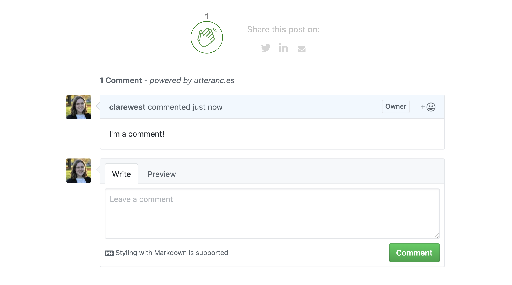

I don't track visitors on this blog, and while that is nice for their privacy and for my conscience, it does sometimes feel like talking into the void. So I recently added three features for readers to communicate: comment functionality via [utterances](https://utteranc.es/), an [`applause-button`](https://applause-button.com/) by [Colin Eberhardt](https://github.com/ColinEberhardt/), and some buttons for sharing posts to social media.

<!--more-->

<div class="figure">



<p class="caption">Comments, claps and social media buttons</p>

</div>


#### :speech_balloon: Utterances

[Utterances](https://utteranc.es/) is an open source comment widget built on GitHub issues. I really like how lightweight and unobtrusive it is. Not to mention, it was ridiculously easy to set up. 

The [utterances documentation](https://utteranc.es/) even walks you through your options and generates the script to add to your site. The process is:

1. Choose or make a GitHub repo where the issues will live, and make sure the [utterances app](https://github.com/apps/utterances) is installed on it, so it can post issues and comments: [clarewest/blog-comments](https://github.com/clarewest/blog-comments) 
2. Choose how you want your blog-post-to-GitHub-issue mapping to work (I'm using path name, so the title of each issue is the path to the blog post: [clarewest/blog-comments/issues](https://github.com/clarewest/blog-comments/issues)
3. (Optional) Choose a label that will be assigned to the issues on the repo
4. Choose your colour scheme (mine is GitHub light #basic)
5. Get your script, which will look something like this:

```html
<script src="https://utteranc.es/client.js"
        repo="clarewest/blog-comments"
        issue-term="pathname"
        label="comment"
        theme="github-light"
        crossorigin="anonymous"
        async>
</script>
```

If you're on blogdown, your theme may already support utterances. In that case, you don't even have to put this script in yourself. It's okay to feel a little smug if you chose a theme like this.

In my case, this was already in `layouts/partial/utterances.html`:

```html
<section id="comments">
    <div class="py-3 content">
        <div class="container">
            <div class="row justify-content-center">
                <div class="col-sm-12 col-lg-8">
                    <div class="comments">
                        <script src="https://utteranc.es/client.js" repo="{{ .Site.Params.commentsrepo }}"
                            issue-term="pathname" label="comment" theme="github-light" crossorigin="anonymous" async>
                            </script>
                    </div>
                </div>
            </div>
        </div>
    </div>
</section>
```

As you can see, the theme author has included a `.Site.Params` variable called `commentsrepo` that I can use, so all I had to do is add this to my `config.yaml` file:

```html
params:
  commentsrepo: clarewest/blog-comments
```

And just like that, we have comments! Your readers have to have a GitHub account in order to leave comments, which is a blessing or a curse, depending on your point of view. 

If you are interested in migrating from Disqus and want to keep your comments, check out [this blog post](https://nanx.me/blog/post/migrating-from-disqus-to-utterances/) by Nan Xiao. 


#### :clap: Applause 

Every millenial knows that commenting is intimidating. A nice amiable non-verbal 'like' is my preferred way to show appreciation. 

I found this brilliant [`applause-button`](https://applause-button.com/) by [Colin Eberhardt](https://github.com/ColinEberhardt/), which allows you to leave a friendly little clap of appreciation. 

Include the small JavaScript and CSS files in your header (either download or source them from the website above):

```html
<head>
  <link rel="stylesheet" href="applause-button.css" />
  <script src="applause-button.js"></script>
</head>
```

Then insert the element wherever you want:
```html
<div class="container">
  <applause-button style="width: 58px; height: 58px;"/>
</div>
```

<div class="container">
<applause-button style="width: 58px; height: 58px;"/>
</div>

It seems super easy, but I had a couple of problems that left me a bit perplexed (okay fine, I sulked and ate half a toblerone).

First, I had trouble making the button display the total number of claps. The number 1 appeared when I clicked it, but didn't survive a page refresh. 

You can see the number of claps recorded for a page through a request to the API:

```commandline
curl -e robot https://api.applause-button.com/get-claps?url=https://clarewest.github.io/blog/post/claps-and-comments-in-blogdown/
1
```

This is also how the JavaScript fetches the number of claps to display on the page. Calling the API showed I had some claps for the page, but they weren't showing up on the applause button on the website. 

Eventually, I worked out the problem(s): 
1. The button automatically gets the number of claps for a URL based on the HTTP Referer header, or you can specify the URL using `url = "my/blog/post/url"`. 
2. The API ignores requests without a Referer specified as a way of screening out bots. 

The [Referer request header](https://developer.mozilla.org/en-US/docs/Web/HTTP/Headers/Referer) contains the address of a page making a request, so that the server can identify where the request is coming from. A request might be, for example, following a link to another website, or, in this case, an API call. 

You can [control how much information is sent in the Referer request header](https://developer.mozilla.org/en-US/docs/Web/HTTP/Headers/Referrer-Policy) using a meta element in the HTML page. The default is `no-referrer-when-downgrade`, which means send my URL unless it's going to a domain less secure than mine (i.e. HTTPS -> HTTP).

My problem was that my referrer was set to `"no-referrer"` which sends an empty string - this meant that the script couldn't send the blog post's URL with the request automatically, and, even when I specified the URL explicitly, the API calls from my blog posts were being ignored because I had sent no Referer. As a result the number of claps wasn't being displayed. 

I changed my header tag from `no-referrer` to `strict-origin`, which sends the origin of the URL, unless it's to a less secure destination. 

You could also use `{{ .Permalink }}`, the Hugo parameter for the URL of the page, but I'm not sure where else this will be used so I thought it would be better not to use the entire URL if I can help it. If you know more about this and think I made a bad choice, please let me know!

```html
<meta name="referrer" content="no-referrer">       <!-- no claps for you -->
<meta name="referrer" content="strict-origin">  
```

I also explicitly included the URL in the element in each blog post, to make sure the count still works. To include this button in each blog post, I added the element to my `single.html` partial template. 

```html
<applause-button style="width: 50px; height: 50px;" multiclap="true" url="{{ .Permalink }}"/>
```

The `multiclap="true"` means that one user can clap more than once - so, go crazy!

I originally just put it at the bottom, but a cruel-but-kind friend pointed out that I should put it at the top too, as people are much less likely to reach the end of the post. 


### :love_letter: Share to Social Media
Finally, I wanted to add some buttons at the bottom of my post to make it easy to share the post. 

I found [a script for that from hugocodex.org](http://hugocodex.org/add-ons/share-buttons/), a website by J.H. van der Schee showcasing Hugo scripts. It includes icons with sharing links for a range of social medias (including the relevant fill colour on hover). You just have to download `share-buttons.html` to your `layouts/partials` directory, and include it where you want it on your website (in my case, `single.html`):

```html
{{ partial "share-buttons.html" . }}
```

The script is quite long, so I won't share the whole thing here, but I did make a couple of changes. 

First, I removed Facebook and Pinterest (personal taste) as well as Google plus (which apparently no longer exists).

Second, the script uses a URL for sharing to Twitter that no longer works, so I updated it:

The non-working method in the script:
```html
<div class="twitter" title="Share this on Twitter" onclick="window.open('http://twitter.com/home?status={{ $pageurl }}');">
```

The replacement method:
```html
<div class="twitter" title="Share this on Twitter" onclick="window.open('http://twitter.com/intent/tweet?url={{ $pageurl }}');">
```

And that's it!

Please feel free to comment, clap, and share this post :sun_with_face:


